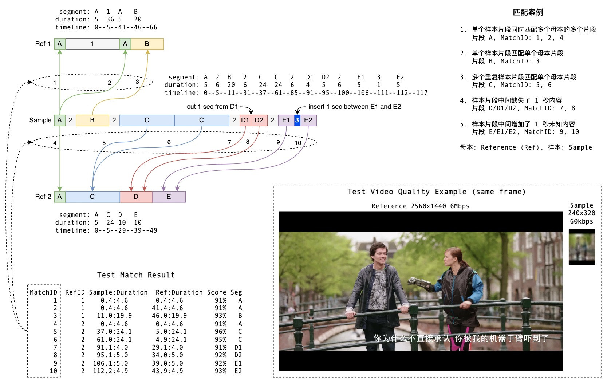

<!--
 * @Description: 
 * @Author: jiangjie
 * @Date: 2022-08-26 11:23:01
 * @LastEditTime: 2022-08-26 16:50:21
 * @LastEditors: jiangjie
 * @Reference: 
-->
# mapping-charts

> 这个是一个用来展示不同样本之间的关系映射图表,作者本人在echarts和anv上找不到合适的图表，所以自己造了一个轮子O.o

[](https://www.npmjs.com/package/mapping-charts) [](https://standardjs.com)


## Install

```bash
npm install --save mapping-charts
```

## Scene

```
  样本对比：比如 基因、视频、数据等等
```

## Usage

```tsx
import * as React from 'react'

import MappingCharts,{hide,show} from 'mapping-charts'
import 'mapping-charts/dist/index.css'

const Example = () => {
  const list  = [
    {
      list:[
        {name:"A1",width:40,height:20,color:'',target:'B2',start:'bottom',end:'top'},
        {name:"A2",width:40,height:20,color:'',target:'B3',start:'bottom',end:'top'},
        {name:"A3",width:60,height:20,color:'',target:'B4',start:'bottom',end:'top'},
        {name:"A4",width:80,height:20,color:'',target:'B5',start:'bottom',end:'top'},
        {name:"A5",width:80,height:20,color:'',target:'B6',start:'bottom',end:'top'},
        {name:"A6",width:80,height:20,color:'',target:'B6',start:'bottom',end:'top'},
        {name:"A7",width:80,height:20,color:'',target:'',start:'bottom',end:'top'},
        {name:"A8",width:80,height:20,color:'',target:'',start:'bottom',end:'top'}
      ],
      title:"样本一",
      distance:0,
      gap:100
    },
    {
      list:[
        {name:"B1",width:40,height:20,color:'green',target:'',start:'',end:''},
        {name:"B2",width:40,height:20,color:'black',target:'',start:'',end:''},
        {name:"B3",width:60,height:20,color:'blue',target:'',start:'',end:''},
        {name:"B4",width:80,height:20,color:'red',target:'',start:'',end:''},
        {name:"B5",width:180,height:20,color:'yellow',target:'',start:'',end:''},
        {name:"B6",width:80,height:20,color:'red',target:'',start:'',end:''},
        {name:"B7",width:180,height:20,color:'red',target:'',start:'',end:''},
        {name:"B8",width:80,height:20,color:'red',target:'',start:'',end:''},
      ],
      title:"样本二",
      distance:0,
      gap:100
    }
  ];
  return (
    <div>
       <MappingCharts elements={list}/>
    </div>
  )
}
```


### config
| name | Description |
|-----------|-------------|
| `name` | 样本片段名称 |
| `width` | 样本片段宽度 |
| `height` | 样本片段高度 |
| `color` | 样本片段颜色 |
| `target` | 样本关联目标 |
| `start` | 样本箭头开始 |
| `end` | 样本箭头结束 |
| `title` |样本名称|
| `distance` | 样本片段间隔距离 |
| `gap` | 样本上下间距 |

### Function

hide() 控制图表隐藏
show() 控制图表显示(默认显示)

## 大概效果




##### 本组件通过<a href="https://github.com/transitive-bullshit/create-react-library/blob/master/readme.zh-CN.md">create-react-library</a>脚手架创建

## License

MIT © [](https://github.com/)
